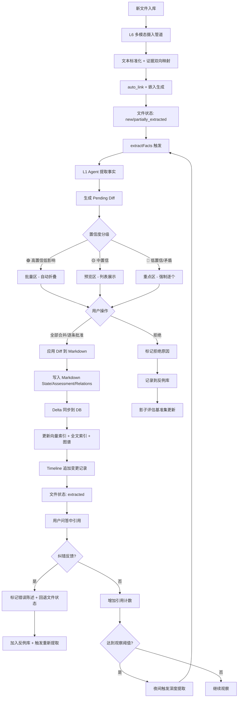
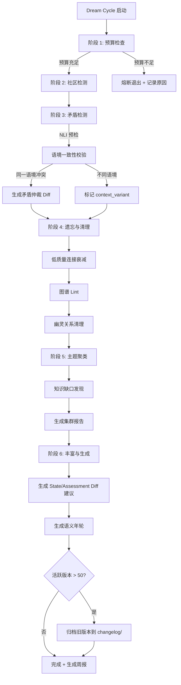

# Alethia AI 知识库 v5.0 — 系统架构总览

> 生成日期：2026-07-04 | 版本：v5.0

---

## 目录

1. [设计哲学与核心原则](#1-设计哲学与核心原则)
2. [架构分层详解（L0 - L7）](#2-架构分层详解l0---l7)
3. [核心数据流](#3-核心数据流)
4. [模块依赖关系](#4-模块依赖关系)
5. [技术栈总览表](#5-技术栈总览表)

---

## 1. 设计哲学与核心原则

### 1.1 认知共生

人类与 AI 不再是单向的"审阅与被审阅"。通过 AI 问答、证据溯源、静默观察和纠错反哺，知识库成为一个持续对话、共同进化的认知场域。每一次问答既是获取知识的行为，也是知识库自我完善的契机——问答即反哺。

核心机制：
- **追问压缩**：多轮对话自动摘要，保持上下文高效
- **静默观察补提取**：高频引用文件自动触发深度提取
- **纠错反哺**：用户纠错自动转化为基准反例
- **证据双语**：非汉语证据自动翻译缓存，脚注可切换

### 1.2 全汉化

从系统底层消息到用户界面，从提示词到证据原文翻译，实现统一的汉语环境。汉语不是一层翻译外衣，而是系统思考的原生语言。

覆盖范围：
- **前端界面**：所有 UI 文本通过 `react-i18next` 渲染，默认 `zh-CN`
- **系统提示词**：Agent 提示词模板以汉语为主版本
- **错误与日志**：运行时错误、审计日志、CLI 输出默认为汉语
- **知识内容**：图谱节点、时间线条目、Diff 建议、证据悬停均为汉语
- **证据双语呈现**：非汉语证据自动翻译，前端脚注默认展示译文

### 1.3 长期可维护

一个运行数年的知识库应当像一座精心保养的图书馆——结构清晰、健康可控、可持久运行。

三大维护支柱：
- **版本归档**：活跃版本条目超阈值后自动归档至 `changelog/`，防止 Markdown 文件膨胀
- **幽灵清理**：rebuild 和 lint 时自动检测死链，标记 orphaned，生成清理建议 Diff
- **影子评估**：基准测试持续回归，异常波动自动熔断，防止系统性污染

### 1.4 人类掌权

所有的自动化都是辅助。State 的修改永远需要人类确认，全自动写入永远可回滚，AI 的建议永远以 Diff 形式呈现。效率的提升绝不牺牲人类对知识的最终裁判权。

保障机制：
- **Diff 审核**：AI 生成的知识变更以 Diff 形式呈现，三级分流（🟢批量 / 🟡预览 / 🔴重点）
- **可回滚**：全自动变更批次可一键回滚，回滚后自动 `rebuild-struct` 保证索引一致
- **不自动写入 State**：即使是高置信度变更，也需用户主动点击"全部合并"
- **审计追踪**：所有变更记录在案，关联操作人和时间戳

### 1.5 Markdown 即真相源

Markdown 是唯一且完全自包含的真相源，数据库纯为缓存池，损坏可一键从 Markdown 全量重建。

核心承诺：
- **DB 纯缓存池**：所有结构化数据均可从 Markdown 重新生成
- **一键重建**：`rebuild-struct` 秒级重建索引，`extract-pending` 按需触发提取
- **完全自包含**：版本历史、语义年轮、变更记录全部追加到 Markdown 文件底部
- **可传世**：静态站点生成接口，脱离服务端可独立浏览

---

## 2. 架构分层详解（L0 - L7）

```
┌──────────────────────────────────────────────────────────────────┐
│                        L0 · 用户交互层                             │
│  Web App / MCP / CLI / REST API · 15 页面 · 8 blocks · 4 layouts │
├──────────────────────────────────────────────────────────────────┤
│                      L0.5 · 统一服务层                             │
│              BrainAPI · 26+ 方法 · 所有逻辑唯一入口                │
├──────────────────────────────────────────────────────────────────┤
│                     L1 · AI Agent 编排层                          │
│     Planner / Retriever / Grader / Generator / Reflector         │
│     追问压缩 · 静默观察 · 纠错反哺 · 证据翻译                     │
├──────────────────────────────────────────────────────────────────┤
│                     L2 · 混合检索层                                │
│  Vector / Fulltext / RRF / Graph / Intent · Rerank · NER · NLI   │
├──────────────────────────────────────────────────────────────────┤
│                     L3 · 知识模型层                                │
│           Compiled Truth Markdown · 八区段规范                     │
├──────────────────────────────────────────────────────────────────┤
│                     L4 · 自进化引擎                                │
│       Dream Cycle 六阶段 · 预算管理 · 归档 · 周报                  │
├──────────────────────────────────────────────────────────────────┤
│                    L4.5 · 影子评估                                 │
│                 基准测试 · 异常熔断 · 回归报告                      │
├──────────────────────────────────────────────────────────────────┤
│                       L5 · 存储层                                  │
│          Markdown FS + PostgreSQL 16 + pgvector                   │
├──────────────────────────────────────────────────────────────────┤
│                     L6 · 多模态摄入                                │
│             8 种输入格式管道 · 证据双向映射                         │
├──────────────────────────────────────────────────────────────────┤
│                       L7 · 可视化层                                │
│         Cytoscape 图谱 · 时间线 · Chart.js 仪表盘                 │
└──────────────────────────────────────────────────────────────────┘
```

---

### L0 · 用户交互层

**定位**：人类与 AI 与知识库交互的所有入口，负责呈现、交互、协议适配。

**核心模块**：

| 模块 | 数量 | 说明 |
|------|------|------|
| 页面 (Routes) | 15 | 问答、审核、图谱、仪表盘、设置等完整页面 |
| 区块 (Blocks) | 8 | 可复用的功能组件块 |
| 布局 (Layouts) | 4 | Shell、Sidebar、TopBar、StatusBar |
| 上下文 (Contexts) | 3 | Auth、Theme、Settings |

**关键文件路径**：

- 页面：[file:///workspace/web/src/routes/](file:///workspace/web/src/routes/)
  - `QAPanelPage.tsx` — 共生问答面板
  - `DiffReviewPage.tsx` — Diff 审核中心
  - `GraphFullPage.tsx` — 知识图谱全图
  - `DashboardPage.tsx` — 健康仪表盘
  - `WikiHomePage.tsx` / `WikiEntryPage.tsx` — Wiki 浏览
  - `TimelineFullPage.tsx` — 时间线叙事
  - `EvalReportPage.tsx` — 影子评估报告
  - `ChangelogPage.tsx` — 全自动变更面板
  - `LibraryFilePage.tsx` — 图书馆文件查看
  - `SearchResultPage.tsx` — 搜索结果
  - `SettingsPage.tsx` — 设置
  - `LoginPage.tsx` / `OnboardingPage.tsx` — 登录与引导

- 区块：[file:///workspace/web/src/blocks/](file:///workspace/web/src/blocks/)
  - `MessageBubble.tsx` — 对话气泡
  - `EvidencePopover.tsx` — 证据弹窗（双语切换）
  - `DiffCard.tsx` — Diff 卡片
  - `GlobalSearch.tsx` — 全局搜索
  - `GraphNodeCard.tsx` — 图谱节点卡片
  - `BudgetBadge.tsx` — 预算徽章
  - `QuickAskButton.tsx` — 快速提问按钮
  - `UserMenu.tsx` — 用户菜单

- 布局：[file:///workspace/web/src/layouts/](file:///workspace/web/src/layouts/)
  - `Shell.tsx` — 整体壳布局
  - `Sidebar.tsx` — 侧边导航
  - `TopBar.tsx` — 顶部栏
  - `StatusBar.tsx` — 状态栏

- 上下文：[file:///workspace/web/src/store/](file:///workspace/web/src/store/)
  - `AuthContext.tsx` — 认证状态
  - `ThemeContext.tsx` — 主题切换
  - `SettingsContext.tsx` — 用户设置

---

### L0.5 · 统一服务层（BrainAPI）

**定位**：所有业务逻辑的唯一实现层，消除多入口代码重复和行为不一致。各入口（Web、MCP、CLI、REST）仅做协议适配。

**核心方法（26+）**：

知识提取与维护：
- `extractFacts(filePath)` — 从文件提取事实
- `applyDiff(diffId, approved)` — 应用或拒绝 Diff
- `rollbackAutoChange(batchId)` — 回滚自动变更批次

检索与查询：
- `query(params)` — L2 混合检索
- `getMedia(hash, range?)` — 获取媒体文件（支持 Range）
- `askQuestion(request)` — 认知共生问答

索引重建：
- `rebuildStruct()` — 秒级重建索引结构
- `extractPending()` — 提取待处理文件

质量评估：
- `shadowEval()` — 影子评估基准测试
- `translateEvidence(spanIds, targetLang)` — 证据翻译

系统状态：
- `getHealth()` — 仪表盘全量数据
- `setDailyBudget(amount)` — 设置日预算
- `getRemainingBudget()` — 获取剩余预算
- `listObservedFiles()` — 观察列表
- `triggerObservedExtraction(fileHash)` — 触发观察提取
- `submitFeedback(conversationId, messageId, feedback)` — 提交纠错反馈

长期维护：
- `archiveVersions(entitySlug?)` — 版本历史归档
- `cleanGhostRelations()` — 幽灵关系清理

静态站点：
- `generateStaticSite(outputPath, options)` — 生成静态站点

**关键文件路径**：

- 主实现：[file:///workspace/server/src/brainapi/index.ts](file:///workspace/server/src/brainapi/index.ts)
- 静态站点：[file:///workspace/server/src/brainapi/static.ts](file:///workspace/server/src/brainapi/static.ts)
- 共享类型：[file:///workspace/shared/types/](file:///workspace/shared/types/)

---

### L1 · AI Agent 编排层

**定位**：共生问答与知识提取的智能核心，通过多 Agent 协作实现可控反思与证据闭环。

**核心 Agent**：

| Agent | 职责 | 文件 |
|-------|------|------|
| Planner | 分析问题，制定检索计划和推理步骤 | [file:///workspace/server/src/agents/planner.ts](file:///workspace/server/src/agents/planner.ts) |
| Retriever | 调用 L2 混合检索，获取相关文档片段 | [file:///workspace/server/src/agents/retriever.ts](file:///workspace/server/src/agents/retriever.ts) |
| Grader | 评分卡评估（事实准确/覆盖完整/来源清晰/证据覆盖率） | [file:///workspace/server/src/agents/grader.ts](file:///workspace/server/src/agents/grader.ts) |
| Generator | 基于检索结果生成答案，每个事实附带 evidence_span | [file:///workspace/server/src/agents/generator.ts](file:///workspace/server/src/agents/generator.ts) |
| Reflector | 评估是否需要补充检索，控制迭代，注入缺失证据 | [file:///workspace/server/src/agents/reflector.ts](file:///workspace/server/src/agents/reflector.ts) |

**标准循环**：

```
Planner → Retriever → Grader → Generator
   ↑                            │
   └──────── Reflector ──────────┘
```

**可控反思机制**：
- **信息增益追踪**：连续两轮未新增实体/证据 → 自动停止
- **预算熔断**：最多 3-5 轮反思，总耗时 < 3-5 秒
- **证据覆盖率达标**：覆盖率 ≥ 0.8 且置信度稳定 → 停止

**四大扩展模块**：

| 扩展 | 功能 | 文件 |
|------|------|------|
| 追问压缩 | 多轮对话自动摘要压缩，保持上下文高效 | [file:///workspace/server/src/agents/compression.ts](file:///workspace/server/src/agents/compression.ts) |
| 静默观察 | 记录高频引用文件，达到阈值触发补提取 | [file:///workspace/server/src/agents/observe.ts](file:///workspace/server/src/agents/observe.ts) |
| 纠错反哺 | 用户纠错自动转化为基准反例，回退源文件状态 | [file:///workspace/server/src/agents/feedback.ts](file:///workspace/server/src/agents/feedback.ts) |
| 证据翻译 | 异步翻译非汉语证据，缓存复用 | [file:///workspace/server/src/agents/translate.ts](file:///workspace/server/src/agents/translate.ts) |

---

### L2 · 混合检索层

**定位**：多策略检索融合，提供精准、全面、可解释的知识检索能力。

**核心组件**：

| 组件 | 技术 | 说明 | 文件 |
|------|------|------|------|
| 向量检索 | pgvector HNSW | 语义相似度匹配 | [file:///workspace/server/src/retrieval/vector.ts](file:///workspace/server/src/retrieval/vector.ts) |
| 全文检索 | PG tsvector | 关键词精确匹配 | [file:///workspace/server/src/retrieval/fulltext.ts](file:///workspace/server/src/retrieval/fulltext.ts) |
| RRF 融合 | Reciprocal Rank Fusion | 向量 + 全文结果融合 | [file:///workspace/server/src/retrieval/rrf.ts](file:///workspace/server/src/retrieval/rrf.ts) |
| 图谱遍历 | 实体关系图 | 沿关系链扩展检索 | [file:///workspace/server/src/retrieval/graph.ts](file:///workspace/server/src/retrieval/graph.ts) |
| 意图路由 | 命名实体识别 | 识别实体类型，路由到对应索引 | [file:///workspace/server/src/retrieval/router.ts](file:///workspace/server/src/retrieval/router.ts) |
| 重排序 | zerank-2 | 对融合结果精排 | [file:///workspace/server/src/retrieval/rerank.ts](file:///workspace/server/src/retrieval/rerank.ts) |
| 来源感知 | - | 区分来源类型，加权排序 | [file:///workspace/server/src/retrieval/source.ts](file:///workspace/server/src/retrieval/source.ts) |
| NLI 校验 | RoBERTa-mnli | 轻量矛盾预检 | [file:///workspace/server/src/retrieval/nli.ts](file:///workspace/server/src/retrieval/nli.ts) |

**检索流水线**：

```
查询 → 意图路由(NER) → 向量检索 ──┐
                 └─→ 全文检索 ── RRF 融合 → 图谱扩展 → 重排序 → 来源加权 → NLI 校验 → 结果
```

**关键文件路径**：[file:///workspace/server/src/retrieval/](file:///workspace/server/src/retrieval/)

---

### L3 · 知识模型层

**定位**：定义知识的结构化表示规范，是 Markdown 真相源的骨架。

**Compiled Truth Markdown 八区段规范**：

每个 Wiki 条目是一个完全自包含的 Markdown 文件，包含以下标准区段：

| 区段 | 位置 | 来源 | 说明 |
|------|------|------|------|
| Front Matter | 顶部 YAML | 机读 | 元数据：slug、别名、创建/更新时间、状态 |
| 概述 (Summary) | 上线区上部 | AI 建议·人类确认 | 实体的一句话定义和核心属性 |
| 状态 (State) | 上线区 | AI 建议·人类确认 | 结构化事实表 |
| 评估 (Assessment) | 上线区 | AI 建议·人类确认 | 置信度、矛盾标记、证据覆盖 |
| 关系 (Relations) | 上线区 | AI 建议·人类确认 | 指向其他实体的链接关系 |
| 讨论线程 (Threads) | 上线区 | AI 建议·人类确认 | 矛盾与未决问题记录 |
| 时间线 (Timeline) | 下线区 | 全自动追加 | 状态变更历史 |
| 版本历史 (Version History) | 下线区底部 | 全自动追加 | 完整版本链（活跃 + 归档指针） |
| 语义年轮 (Semantic Rings) | 下线区 | 全自动追加 | 人类对概念理解的阶段性变迁 |
| 证据 (Evidence) | 下线区 | 全自动追加 | 引用的原文片段与位置映射 |

**两层知识图谱**：
- **L1 索引图谱**：实时、零 LLM、从 Markdown 链接提取
- **L2 语义图谱**：夜间构建、LLM 增强、语义相似度聚类
- **L2.5 主题聚类标签**：动态生成，集群报告存于 `summaries/`

**关键文件路径**：
- Markdown 解析器：[file:///workspace/server/src/storage/parser.ts](file:///workspace/server/src/storage/parser.ts)
- 存储同步：[file:///workspace/server/src/storage/sync.ts](file:///workspace/server/src/storage/sync.ts)
- Wiki 内容：[file:///workspace/wiki/](file:///workspace/wiki/)

---

### L4 · 自进化引擎

**定位**：驱动知识库自主成长与维护的后台引擎。

**Dream Cycle 六阶段**：

| 阶段 | 操作 | 触发时机 | 说明 |
|------|------|----------|------|
| 1. 预算检查 | 校验日/月预算 | 入口 | 未达标则全部跳过，记录熔断原因 |
| 2. 社区检测 | community_detect + report | 夜间 | 图谱聚类 + 集群报告 |
| 3. 矛盾检测 | NLI 预检 → 语境矛盾分析 | 夜间 | 同一语境冲突才仲裁 |
| 4. 遗忘与清理 | forget_decay + lint + 幽灵清理 | 夜间 | 衰减低质量连接，清理死链 |
| 5. 主题聚类 | topic_cluster + gap_analysis | 夜间 | 发现知识缺口 |
| 6. 丰富与生成 | State/Assess Diff + 语义年轮 + 归档 | 夜间 | 生成建议 Diff，追加全自动区块 |

**全局预算管理**：
- 日预算上限（默认 $5）
- 月预算上限（默认 $50）
- 单次问答上限（默认 $0.5）
- 达到上限自动熔断所有非交互式 AI 任务

**长期维护任务**：
- **版本历史归档**：活跃版本 > 50 条时自动归档旧记录
- **幽灵关系清理**：自动检测死链，生成清理建议
- **证据翻译缓存刷新**：过期或过大缓存清理
- **健康指标周报**：周级生成趋势报告

**关键文件路径**：
- Dream Cycle：[file:///workspace/server/src/evolution/dream.ts](file:///workspace/server/src/evolution/dream.ts)
- 预算管理：[file:///workspace/server/src/evolution/budget.ts](file:///workspace/server/src/evolution/budget.ts)
- 归档：[file:///workspace/server/src/evolution/archive.ts](file:///workspace/server/src/evolution/archive.ts)
- 幽灵清理：[file:///workspace/server/src/evolution/ghost.ts](file:///workspace/server/src/evolution/ghost.ts)
- 回滚：[file:///workspace/server/src/evolution/rollback.ts](file:///workspace/server/src/evolution/rollback.ts)
- 周报：[file:///workspace/server/src/evolution/weekly.ts](file:///workspace/server/src/evolution/weekly.ts)

---

### L4.5 · 影子评估

**定位**：离线零污染的质量保障体系，持续监控系统表现，异常自动熔断。

**核心机制**：
- **基准事实库**：正例来自长期稳定 State，反例定义为"禁止输出的错误陈述"
- **自动回归测试**：周期性运行基准集，生成回归报告
- **回归报告关联 Git commit**：每次评估记录代码版本
- **异常熔断**：评估指标波动超阈值 → 自动中止评估并告警
- **零污染原则**：影子评估在沙箱中运行，绝不影响生产数据

**关键文件路径**：[file:///workspace/server/src/evolution/shadow.ts](file:///workspace/server/src/evolution/shadow.ts)

---

### L5 · 存储层

**定位**：知识库的持久化基座，Markdown 文件系统是真相源，PostgreSQL 是纯缓存池。

**Markdown 文件系统**：

```
wiki/
├── index.md           # 首页索引
├── AGENTS.md          # Agent 文档
├── raw/               # 人类原始笔记
├── wiki/              # 编译后的知识条目
├── summaries/         # 集群报告（稳定锚点）
├── library/           # 源文件档案库
├── skills/            # 技能与提示词
│   └── prompts/       # Agent 提示词模板
├── changelog/         # 归档的版本历史
└── .manifest.json     # 清单文件
```

**PostgreSQL 纯缓存池**：

| 表 | 用途 |
|----|------|
| pages | 页面元数据索引 |
| page_fts | 全文搜索索引（tsvector） |
| embeddings | 向量嵌入（pgvector） |
| links | 实体关系链接 |
| timeline | 时间线条目 |
| communities | 聚类社区 |
| knowledge_versions | 知识版本记录 |
| pending_diffs | 待审核 Diff |
| clusters | 主题聚类 |
| library_files | 图书馆文件索引 |
| conversation_logs | 对话日志 |
| evidence_translations | 证据翻译缓存 |
| ghost_relations | 幽灵关系标记 |
| observed_files | 观察列表文件 |
| eval_anomaly_flags | 评估异常标记 |

**Delta 同步**：
- 文件系统 ↔ 数据库双向同步
- 灾难恢复：`rebuild-struct` 从 Markdown 全量重建

**关键文件路径**：
- 数据库连接：[file:///workspace/server/src/db/pool.ts](file:///workspace/server/src/db/pool.ts)
- 迁移：[file:///workspace/server/src/db/migrations/](file:///workspace/server/src/db/migrations/)
- 向量维度：[file:///workspace/server/src/db/dimension.ts](file:///workspace/server/src/db/dimension.ts)
- Markdown 存储：[file:///workspace/server/src/storage/markdown.ts](file:///workspace/server/src/storage/markdown.ts)
- 清单管理：[file:///workspace/server/src/storage/manifest.ts](file:///workspace/server/src/storage/manifest.ts)

---

### L6 · 多模态摄入

**定位**：将各种格式的输入转化为标准化文本和知识条目。

**8 种输入格式管道**：

| 格式 | 管道 | 说明 | 文件 |
|------|------|------|------|
| 纯文本 | text | .txt、.md 直接入库 | [file:///workspace/server/src/ingest/text.ts](file:///workspace/server/src/ingest/text.ts) |
| 网页 | web | URL 抓取 + 正文提取 | [file:///workspace/server/src/ingest/web.ts](file:///workspace/server/src/ingest/web.ts) |
| PDF 文档 | document | pdf-parse 提取文本 | [file:///workspace/server/src/ingest/document.ts](file:///workspace/server/src/ingest/document.ts) |
| Word 文档 | document | mammoth 转换 | [file:///workspace/server/src/ingest/document.ts](file:///workspace/server/src/ingest/document.ts) |
| Excel/CSV | document | xlsx 解析 | [file:///workspace/server/src/ingest/document.ts](file:///workspace/server/src/ingest/document.ts) |
| 图片 | image | OCR + VLM（远期） | [file:///workspace/server/src/ingest/image.ts](file:///workspace/server/src/ingest/image.ts) |
| 音频 | audio | 语音转写 + 时间码锚点 | [file:///workspace/server/src/ingest/audio.ts](file:///workspace/server/src/ingest/audio.ts) |
| 视频 | video | 音频提取 + 转写 + 帧提取 | [file:///workspace/server/src/ingest/video.ts](file:///workspace/server/src/ingest/video.ts) |

**证据双向映射**：
- 标准化文本偏移（source_text_offset）
- 原始位置映射（original_location：页码/时间码/段落）

**清洗管道**：去重、格式统一、敏感信息脱敏

**关键文件路径**：
- 主管道：[file:///workspace/server/src/ingest/pipeline.ts](file:///workspace/server/src/ingest/pipeline.ts)
- 清洗：[file:///workspace/server/src/ingest/clean.ts](file:///workspace/server/src/ingest/clean.ts)

---

### L7 · 可视化层

**定位**：将知识结构与系统状态以直观方式呈现给用户。

**核心可视化组件**：

| 组件 | 技术 | 功能 | 位置 |
|------|------|------|------|
| 知识图谱 | Cytoscape.js | 节点-边图、聚类框、时间推演 | GraphFullPage |
| Markdown 渲染 | markdown-it + 自定义插件 | 富文本、媒体原地渲染、证据脚注 | 全站 |
| 共生问答面板 | 自定义组件 | 多轮对话、证据双语、纠错反馈 | QAPanelPage |
| 健康仪表盘 | Chart.js + react-chartjs-2 | 三角规模、预算进度、健康告警 | DashboardPage |
| 全自动变更面板 | 自定义组件 | 24h 变更列表、一键回滚、归档批次 | ChangelogPage |
| 时间线叙事视图 | 自定义组件 | 媒体原地渲染、时间线叙事 | TimelineFullPage |
| 影子评估报告 | 自定义组件 | 回归报告、异常熔断告警 | EvalReportPage |
| Diff 对比视图 | 自定义组件 | 原文对比、三级分流 | DiffReviewPage |

**关键文件路径**：
- Markdown 渲染：[file:///workspace/web/src/components/MarkdownRenderer.tsx](file:///workspace/web/src/components/MarkdownRenderer.tsx)
- 媒体组件：[file:///workspace/web/src/components/brain-media.tsx](file:///workspace/web/src/components/brain-media.tsx)
- Diff 对比：[file:///workspace/web/src/components/DiffCompare.tsx](file:///workspace/web/src/components/DiffCompare.tsx)
- 前端入口：[file:///workspace/web/src/App.tsx](file:///workspace/web/src/App.tsx)

---

## 3. 核心数据流

### 3.1 用户提问 → 回答生成的完整链路

```mermaid
sequenceDiagram
    participant U as 用户
    participant FE as 前端 Web App
    participant API as BrainAPI
    participant P as Planner
    participant R as Retriever
    participant L2 as L2 混合检索
    participant G as Grader
    participant Gen as Generator
    participant Ref as Reflector
    participant LLM as LLM 模型
    participant DB as PostgreSQL
    participant FS as Markdown FS

    U->>FE: 输入问题
    FE->>API: POST /api/ask
    API->>API: 预算检查
    alt 预算不足
        API-->>FE: 返回熔断提示
        FE-->>U: 显示预算告警
    end
    API->>P: 分析问题，制定计划
    P->>LLM: 调用 Planner 提示词
    LLM-->>P: 返回检索计划
    
    loop 反思循环（最多 3-5 轮）
        P->>R: 执行检索计划
        R->>L2: 调用混合检索
        L2->>DB: 向量 + 全文 + 图谱查询
        DB-->>L2: 返回候选结果
        L2-->>R: 返回融合+重排结果
        R-->>Gen: 传递检索结果 + 证据
        
        Gen->>LLM: 调用 Generator 提示词
        LLM-->>Gen: 返回答案 + evidence_span
        Gen-->>G: 传递生成结果
        
        G->>LLM: 调用 Grader 评分卡
        LLM-->>G: 返回评分（事实/覆盖/来源/证据覆盖率）
        G-->>Ref: 传递评分结果
        
        Ref->>Ref: 评估是否需要继续
        alt 信息增益为零 / 覆盖率达标 / 熔断
            Ref-->>API: 停止，返回最优结果
            break
        end
        Ref->>Gen: 注入缺失证据，继续下一轮
    end
    
    API->>API: 异步触发证据翻译（如需要）
    API->>API: 记录观察文件（静默观察）
    API->>DB: 保存对话日志
    API-->>FE: 返回答案 + 来源 + 置信度
    FE-->>U: 展示回答 + 脚注 + 证据双语
```

---

### 3.2 知识摄入 → 审核 → 写入 → 反哺



---

### 3.3 Dream Cycle 六阶段执行流程



---

## 4. 模块依赖关系

### 4.1 后端模块依赖拓扑

**依赖原则**：
- 上层依赖下层，下层不依赖上层
- 同层模块之间通过 BrainAPI 协调，不直接交叉依赖
- BrainAPI 是唯一的业务逻辑编排者

**依赖方向（从上到下）**：

```
routes/ (HTTP 路由适配)
    ↓
brainapi/ (统一服务层) ← mcp/ (MCP 适配) ← cli/ (CLI 适配)
    ↓
┌───────────────┬───────────────┬───────────────┐
agents/      retrieval/      evolution/      ingest/
 (L1 编排)     (L2 检索)      (L4 进化)       (L6 摄入)
    ↓               ↓               ↓               ↓
└───────────────┴───────┬───────┴───────────────┘
                        ↓
                  storage/ (L3 知识模型)
                        ↓
              llm/ (模型适配器) ← config/
                        ↓
                  db/ (L5 数据库)  ← i18n/
                        ↓
                  Markdown FS
```

**模块依赖表**：

| 模块 | 直接依赖 | 被依赖 | 核心职责 |
|------|----------|--------|----------|
| routes/ | brainapi | 无 | HTTP 协议适配、认证中间件 |
| brainapi/ | agents, retrieval, evolution, storage, ingest, llm, db | routes, mcp, cli | 业务逻辑唯一入口，编排协调 |
| agents/ | retrieval, llm, storage | brainapi | AI Agent 编排、问答、反思 |
| retrieval/ | db, llm | brainapi, agents | 混合检索、向量/全文/图谱 |
| evolution/ | storage, llm, db, retrieval | brainapi | Dream Cycle、预算、归档、影子评估 |
| ingest/ | storage, llm | brainapi | 多模态摄入、文本清洗 |
| storage/ | db, fs | brainapi, agents, evolution, ingest | Markdown 解析、Delta 同步 |
| llm/ | config | agents, retrieval, evolution, ingest | 10 家大模型适配、路由 |
| db/ | 无 (底层) | storage, retrieval, evolution, brainapi | PostgreSQL 连接、迁移、DAO |
| config/ | 无 (底层) | llm, brainapi | 配置加载、Zod 校验 |
| i18n/ | 无 (底层) | 全局 | 中文日志、错误映射 |
| auth/ | 无 (底层) | routes | Bearer Token 认证 |

**关键文件路径**：
- 服务入口：[file:///workspace/server/src/index.ts](file:///workspace/server/src/index.ts)
- HTTP 路由：[file:///workspace/server/src/routes/](file:///workspace/server/src/routes/)
- MCP 服务：[file:///workspace/server/src/mcp/server.ts](file:///workspace/server/src/mcp/server.ts)
- CLI 入口：[file:///workspace/server/src/cli/brain.ts](file:///workspace/server/src/cli/brain.ts)

---

### 4.2 前后端 API 映射表

**认证方式**：所有受保护接口需携带 `Authorization: Bearer <BRAIN_API_KEY>`

#### 公开接口

| 方法 | 路径 | BrainAPI 方法 | 功能 |
|------|------|---------------|------|
| GET | `/health` | `getHealth` (精简) | 系统健康状态 |
| POST | `/api/auth/login` | - | 登录验证（校验 API Key） |

#### 问答与对话

| 方法 | 路径 | BrainAPI 方法 | 功能 |
|------|------|---------------|------|
| POST | `/api/ask` | `askQuestion` | AI 问答（多轮反思 + 认知共生） |
| GET | `/api/conversations/:id` | - | 获取对话历史 |
| PUT | `/api/feedback` | `submitFeedback` | 提交纠错/有用反馈 |

#### 检索与查询

| 方法 | 路径 | BrainAPI 方法 | 功能 |
|------|------|---------------|------|
| POST | `/api/query` | `query` | L2 混合检索 |
| GET | `/api/graph` | - | 全图节点与边 |
| GET | `/api/search` | `query` (简化) | 搜索结果 |

#### Diff 审核与回滚

| 方法 | 路径 | BrainAPI 方法 | 功能 |
|------|------|---------------|------|
| GET | `/api/diffs` | - | 待审核变更列表 |
| POST | `/api/diffs/:id/apply` | `applyDiff` | 应用变更 |
| POST | `/api/diffs/:id/reject` | `applyDiff` | 拒绝变更 |
| POST | `/api/rollback/:batchId` | `rollbackAutoChange` | 回滚自动变更批次 |

#### 知识库维护

| 方法 | 路径 | BrainAPI 方法 | 功能 |
|------|------|---------------|------|
| POST | `/api/rebuild-struct` | `rebuildStruct` | 重建知识库结构索引 |
| POST | `/api/extract-pending` | `extractPending` | 提取待处理文件 |
| GET | `/api/observed-files` | `listObservedFiles` | 观察列表 |
| POST | `/api/trigger-extract` | `triggerObservedExtraction` | 触发观察文件提取 |
| POST | `/api/archive-versions` | `archiveVersions` | 版本历史归档 |
| POST | `/api/clean-ghost` | `cleanGhostRelations` | 幽灵关系清理 |

#### 媒体与图书馆

| 方法 | 路径 | BrainAPI 方法 | 功能 |
|------|------|---------------|------|
| GET | `/api/library/:hash` | `getMedia` | 获取媒体文件（支持 Range） |
| GET | `/api/evidence/translate` | `translateEvidence` | 证据翻译 |

#### 仪表盘与系统

| 方法 | 路径 | BrainAPI 方法 | 功能 |
|------|------|---------------|------|
| GET | `/api/health-dashboard` | `getHealth` | 仪表盘全量数据 |
| GET | `/api/shadow-eval` | `shadowEval` | 影子评估报告 |
| POST | `/api/shadow-eval/run` | `shadowEval` | 触发影子评估 |

#### 配置管理

| 方法 | 路径 | BrainAPI 方法 | 功能 |
|------|------|---------------|------|
| GET | `/api/settings` | - | 获取全局设置 |
| PUT | `/api/settings` | `setDailyBudget` 等 | 更新设置 |
| GET | `/api/llm/adapters` | - | LLM 适配器状态 |
| POST | `/api/llm/test` | - | 测试适配器连通性 |

**关键文件路径**：
- BrainAPI 路由：[file:///workspace/server/src/routes/brainapi.ts](file:///workspace/server/src/routes/brainapi.ts)
- 健康检查：[file:///workspace/server/src/routes/health.ts](file:///workspace/server/src/routes/health.ts)
- LLM 管理：[file:///workspace/server/src/routes/llm.ts](file:///workspace/server/src/routes/llm.ts)
- 设置管理：[file:///workspace/server/src/routes/settings.ts](file:///workspace/server/src/routes/settings.ts)
- 前端 API 客户端：[file:///workspace/web/src/lib/api.ts](file:///workspace/web/src/lib/api.ts)

---

## 5. 技术栈总览表

| 类别 | 技术选型 | 说明 |
|------|----------|------|
| **运行时** | Bun 1.x | 高性能 JavaScript/TypeScript 运行时，替代 Node.js |
| **后端框架** | Hono 4.x | 轻量级 HTTP 框架，Bun 原生优化，Edge 友好 |
| **前端框架** | React 18 + Vite 5 | 组件化 UI + 快速构建工具 |
| **状态管理** | TanStack Query v5 + React Context | 服务端状态缓存 + 轻量全局状态 |
| **路由** | React Router v6 | 前端 SPA 路由 |
| **样式** | Tailwind CSS 3 | 原子化 CSS 框架 |
| **UI 组件** | Headless UI + Floating UI | 无样式组件库 + 浮层定位 |
| **国际化** | react-i18next | 默认 zh-CN，预留 en |
| **图标** | Phosphor Icons | 轻量化图标库 |
| **拖拽** | @dnd-kit | 现代拖拽库 |
| **数据库** | PostgreSQL 16 | 关系型数据库，标准 SQL |
| **向量检索** | pgvector + HNSW | PG 扩展，向量相似搜索 |
| **全文检索** | PG tsvector / tsquery | PG 内置全文搜索，统一不引入额外引擎 |
| **SQL 构建** | Kysely 0.27 | 类型安全的 SQL 查询构建器 |
| **数据库驱动** | pg (node-postgres) | PG 官方 Node.js 驱动 |
| **LLM 适配** | 10 家国产大模型 | 百炼、智谱、月之暗面、文心、星火、混元、MiniMax、DeepSeek、零一万物、百川 |
| **LLM 路由** | 自研 Router | 按成本/质量/可用性智能路由 |
| **嵌入模型** | MiniLM (local) / 厂商嵌入 | 默认本地 @xenova/transformers，可切换厂商 |
| **重排序** | zerank-2 | 跨编码器重排序 |
| **NLI 校验** | RoBERTa-mnli (local) | 轻量自然语言推理，矛盾预检 |
| **Markdown 解析** | unified + remark + gray-matter | 后端 Markdown AST 解析 |
| **Markdown 渲染** | markdown-it + highlight.js | 前端 Markdown 渲染 + 代码高亮 |
| **图谱可视化** | Cytoscape.js + cose-bilkent | 图论可视化 + 布局算法 |
| **图表** | Chart.js + react-chartjs-2 | 数据可视化 |
| **多模态摄入** | pdf-parse / mammoth / xlsx / tesseract.js | 多种文档格式解析 |
| **网页提取** | @extractus/article-extractor | 网页正文提取 |
| **配置校验** | Zod 3.x | TypeScript-first 模式校验 |
| **日志** | pino 9.x | 高性能 JSON 日志 |
| **YAML** | yaml | 配置文件解析 |
| **测试** | Bun test | Bun 内置测试运行器 |
| **部署** | Docker + docker compose | 容器化一键部署 |
| **反向代理** | Nginx | 前端静态资源 + API 反向代理 |
| **认证** | Bearer Token (API Key) | 简单高效的 API 密钥认证 |
| **共享类型** | TypeScript Workspaces | monorepo 全栈类型共享 |

---

> **文档版本**：v5.0 | **生成日期**：2026-07-04 | **架构版本**：认知共生版
