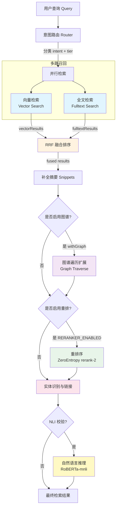

# Alethia AI 知识库 v5.0 — 检索引擎技术详解

> 生成日期：2026-07-04  
> 版本：v5.0  
> 适用范围：检索引擎核心模块

---

## 1. 整体架构

Alethia AI 知识库 v5.0 采用 **多路召回 + 融合排序 + 增强重排** 的三级检索流水线架构。当前实现包含两路核心检索（向量检索 + 全文检索），通过 RRF（Reciprocal Rank Fusion）算法进行融合，结合图谱遍历扩展、实体识别、自然语言推理等增强模块，最终输出精准的检索结果。

### 1.1 架构流程图



### 1.2 核心模块清单

| 模块 | 源文件 | 功能描述 |
|------|--------|----------|
| 向量检索 | `retrieval/vector.ts` | 基于 pgvector + HNSW 索引的语义相似度检索 |
| 全文检索 | `retrieval/fulltext.ts` | 基于 PostgreSQL tsvector 的关键词匹配检索 |
| RRF 融合 | `retrieval/rrf.ts` | 倒数排名融合算法，合并多路检索结果 |
| 图谱遍历 | `retrieval/graph.ts` | 基于递归 CTE 的知识图谱邻居扩展 |
| 重排序 | `retrieval/rerank.ts` | ZeroEntropy rerank-2 交叉编码器重排 |
| 实体识别 | `retrieval/entity.ts` | WikiLink + 正则 + 用户规则库的实体抽取 |
| 自然语言推理 | `retrieval/nli.ts` | RoBERTa-mnli 蕴含/矛盾/中立三分类 |
| 意图路由 | `retrieval/router.ts` | 查询意图分类与检索策略动态调整 |
| 嵌入模型 | `llm/embed.ts` | all-MiniLM-L6-v2 本地嵌入 + 厂商回退 |

---

## 2. 向量检索

向量检索是语义搜索的核心，通过将文本映射到高维向量空间，计算查询与文档的语义相似度。

### 2.1 技术栈

- **向量数据库**：PostgreSQL + pgvector 扩展
- **索引类型**：HNSW（Hierarchical Navigable Small World）
- **嵌入模型**：all-MiniLM-L6-v2（384 维）
- **相似度度量**：余弦距离（cosine distance）

### 2.2 嵌入模型

嵌入模型负责将文本转换为固定维度的向量表示。系统采用双层架构：

**主路径**：通过 `llmRouter` 调用厂商嵌入 API（如 OpenAI、Cohere 等），支持动态模型切换。  
**降级路径**：本地使用 `@xenova/transformers` 加载 `Xenova/all-MiniLM-L6-v2` 模型，采用 mean pooling + L2 归一化。

```typescript
// llm/embed.ts:36-52
async function getLocalEmbedding(text: string): Promise<number[]> {
  if (!localEmbedder) {
    const { pipeline } = await import('@xenova/transformers');
    localEmbedder = await pipeline('feature-extraction', 'Xenova/all-MiniLM-L6-v2');
  }
  const output = await localEmbedder(text, { pooling: 'mean', normalize: true });
  const embedding = Array.from(output.data) as number[];
  return embedding;
}
```

**关键特性**：
- 维度：384 维
-  pooling 策略：均值池化（mean pooling）
- 归一化：L2 归一化（便于余弦相似度计算）
- 惰性加载：首次调用时才加载模型到内存

### 2.3 检索实现

向量检索通过 pgvector 的 `<=>` 操作符计算余弦距离，按相似度降序返回 Top-K 结果。

```typescript
// retrieval/vector.ts:20-30
const pool = getPool();
const vectorStr = `[${embedding.join(',')}]`;
const result = await pool.query(
  `SELECT p.id AS page_id, p.slug, p.title,
          1 - (pe.embedding <=> $1::vector) AS score
   FROM page_embeddings pe
   JOIN pages p ON p.id = pe.page_id
   ORDER BY pe.embedding <=> $1::vector
   LIMIT $2`,
  [vectorStr, k]
);
```

**核心要点**：

| 项目 | 说明 |
|------|------|
| 表结构 | `page_embeddings` 存储页面嵌入向量，`pages` 存储页面元数据 |
| 相似度转换 | `score = 1 - cosine_distance`，将距离转换为 [0, 1] 相似度分数 |
| 排序 | 按余弦距离升序排列（距离越小越相似） |
| 空嵌入保护 | 嵌入为空时直接返回空数组，避免 SQL 错误 |

### 2.4 pgvector 索引建议

虽然代码中未直接创建索引，但生产环境建议在 `page_embeddings.embedding` 列上创建 HNSW 索引：

```sql
CREATE INDEX ON page_embeddings USING hnsw (embedding vector_cosine_ops);
```

HNSW 索引的优势：
- 对数级查询复杂度 O(log n)
- 支持亿级向量规模
- 内存占用相对较小

---

## 3. 全文检索

全文检索基于 PostgreSQL 原生的 tsvector/tsquery 机制，提供精确的关键词匹配能力。

### 3.1 技术原理

PostgreSQL 全文检索的核心是两个数据类型：
- **tsvector**：文档的分词表示，每个词项带有位置和权重信息
- **tsquery**：查询的分词表示，支持布尔运算符（`&` 与、`|` 或、`!` 非）

### 3.2 查询构建

查询文本经过清洗后，使用 `&`（AND）连接所有词项，要求所有关键词都出现在文档中：

```typescript
// retrieval/fulltext.ts:15
const tsQuery = query.replace(/[&|!():*]/g, ' ').trim().split(/\s+/).filter(Boolean).join(' & ');
```

**处理步骤**：
1. 移除特殊字符（`&|!():*`），避免语法错误
2. 按空白字符分割
3. 过滤空词项
4. 用 `&` 连接所有词项（AND 逻辑）

### 3.3 检索与排序

```typescript
// retrieval/fulltext.ts:18-29
const result = await pool.query(
  `SELECT p.id AS page_id, p.slug, p.title,
          ts_headline('simple', pft.source_text, to_tsquery('simple', $1),
            'StartSel=<<, StopSel=>>, MaxWords=35, MinWords=15') AS snippet,
          ts_rank(pft.tsv, to_tsquery('simple', $1)) AS score
   FROM page_fts pft
   JOIN pages p ON p.id = pft.page_id
   WHERE pft.tsv @@ to_tsquery('simple', $1)
   ORDER BY score DESC
   LIMIT $2`,
  [tsQuery, k]
);
```

**关键函数**：

| 函数 | 作用 |
|------|------|
| `to_tsquery('simple', query)` | 将查询文本转换为 tsquery |
| `ts_rank(tsv, query)` | 计算文档与查询的相关度分数 |
| `ts_headline(config, text, query, options)` | 生成高亮摘要片段 |
| `@@` 操作符 | 匹配判断：tsvector 是否包含 tsquery |

### 3.4 中文处理方案

由于 PostgreSQL 内置的中文分词（zhparser 等）需要额外安装扩展，系统采用 `simple` 配置作为兼容方案：

- **simple 配置**：按空白和标点分割，不做词干提取
- **局限**：对中文连续文本效果有限，依赖空格或标点分隔

### 3.5 ILIKE 回退机制

当 tsvector 检索无结果或发生错误时，自动降级到 ILIKE 模糊匹配：

```typescript
// retrieval/fulltext.ts:50-62
async function ilikeSearch(query: string, k: number): Promise<FulltextSearchResult[]> {
  const pattern = `%${query}%`;
  const result = await pool.query(
    `SELECT p.id AS page_id, p.slug, p.title,
            LEFT(p.content_md, 200) AS snippet,
            0.5 AS score
     FROM pages p
     WHERE p.content_md ILIKE $1 OR p.slug ILIKE $1 OR p.title ILIKE $1
     LIMIT $2`,
    [pattern, k]
  );
}
```

**回退触发条件**：
1. tsquery 构造结果为空
2. tsvector 检索返回 0 条结果
3. 检索过程抛出异常

**回退特性**：
- 搜索范围：`content_md`、`slug`、`title` 三列
- 不区分大小写（ILIKE）
- 固定分数：0.5（中等置信度）
- 摘要：取内容前 200 字符

### 3.6 权重分级（ABCD）

PostgreSQL tsvector 支持四级权重（A、B、C、D），可用于区分标题、摘要、正文等不同字段的重要性。虽然当前代码使用默认配置，但架构支持以下权重分配：

| 级别 | 权重 | 建议用途 |
|------|------|----------|
| A | 1.0 | 页面标题（title） |
| B | 0.4 | 页面摘要/简介 |
| C | 0.2 | 章节标题 |
| D | 0.1 | 正文内容 |

---

## 4. RRF 融合算法

RRF（Reciprocal Rank Fusion，倒数排名融合）是一种无参数的结果融合算法，通过排名的倒数之和来综合多路检索结果。

### 4.1 算法公式

```
score(d) = Σ (weight_i / (k + rank_i(d)))
```

其中：
- `d`：文档
- `i`：检索路数索引
- `rank_i(d)`：文档 d 在第 i 路检索中的排名（从 1 开始）
- `weight_i`：第 i 路检索的权重
- `k`：常数参数，控制排名衰减速度

### 4.2 参数配置

```typescript
// retrieval/rrf.ts:15
const RRF_K = 60;
```

**k = 60 的含义**：
- k 值越大，排名衰减越平缓，低排名结果也能获得一定分数
- k = 60 意味着排名第 1 的文档获得 `1/61 ≈ 0.016` 的基础分
- 排名第 60 的文档获得 `1/120 ≈ 0.008` 的基础分（约为第 1 名的一半）

**k 值选择经验**：
- k 较小（如 10）：强调头部结果，适合检索路数较少的场景
- k 较大（如 60）：更均衡地考虑多路结果，容错性更强
- 经验法则：k 通常设置在 20~100 之间

### 4.3 权重分配策略

权重由意图路由动态调整，在 `router.ts` 中定义：

```typescript
// retrieval/router.ts:79-80
const vectorWeight = finalIntent === 'factual' ? 0.7 : 0.5;
const fulltextWeight = finalIntent === 'factual' ? 0.3 : 0.5;
```

| 意图类型 | 向量检索权重 | 全文检索权重 | 说明 |
|----------|-------------|-------------|------|
| factual（事实型） | 0.7 | 0.3 | 事实查询更依赖语义匹配 |
| 其他（ai_qa/topic 等） | 0.5 | 0.5 | 均衡权重，兼顾语义与关键词 |

### 4.4 融合实现

```typescript
// retrieval/rrf.ts:17-47
export function rrfFusion(
  lists: Array<{ results: RRFInput[]; weight: number }>,
  topK: number = 10
): RRFResult[] {
  const scoreMap = new Map<string, RRFResult>();

  for (const { results, weight } of lists) {
    for (let rank = 0; rank < results.length; rank++) {
      const item = results[rank];
      const rrfScore = weight / (RRF_K + rank + 1);

      const existing = scoreMap.get(item.slug);
      if (existing) {
        existing.score += rrfScore;
        if (!existing.snippet && item.snippet) {
          existing.snippet = item.snippet;
        }
      } else {
        scoreMap.set(item.slug, {
          slug: item.slug,
          title: item.title,
          score: rrfScore,
          snippet: item.snippet
        });
      }
    }
  }

  return Array.from(scoreMap.values())
    .sort((a, b) => b.score - a.score)
    .slice(0, topK);
}
```

**算法步骤**：

1. **初始化**：创建 `scoreMap` 存储每个文档的累积分数
2. **遍历每路结果**：对每个检索列表中的文档计算 RRF 分数
3. **分数累加**：同一文档出现在多路结果中时，分数相加
4. **摘要补全**：优先使用有 snippet 的结果（全文检索通常带摘要）
5. **排序截断**：按最终分数降序排列，取 Top-K

**去重键**：使用 `slug` 作为文档唯一标识，而非 `page_id`，确保跨表一致性。

### 4.5 RRF 的优势

与其他融合算法相比，RRF 具有以下优势：

| 特性 | 说明 |
|------|------|
| 无训练需求 | 不需要标注数据训练融合权重 |
| 鲁棒性强 | 对不同规模、不同质量的检索列表适应性好 |
| 实现简单 | 时间复杂度 O(N)，N 为总文档数 |
| 可解释性 | 每个文档的分数来源清晰可追溯 |

---

## 5. 图谱遍历检索

图谱遍历利用知识图谱中的链接关系，从初始结果出发扩展发现相关文档，提升召回率。

### 5.1 数据模型

知识图谱存储在 `links` 表中，每条边包含：

| 字段 | 类型 | 说明 |
|------|------|------|
| source_slug | text | 源页面 slug |
| target_slug | text | 目标页面 slug |
| relation | text | 关系类型 |
| weight | float | 边权重 |
| orphaned | boolean | 是否为孤立链接（目标不存在） |

### 5.2 递归 CTE 实现

图谱遍历使用 PostgreSQL 的 `WITH RECURSIVE` 递归公共表表达式实现：

```typescript
// retrieval/graph.ts:8-24
const result = await pool.query(
  `WITH RECURSIVE graph_traverse AS (
    SELECT source_slug, target_slug, relation, weight, orphaned, 0 AS current_depth
    FROM links
    WHERE source_slug = $1 AND orphaned = false

    UNION ALL

    SELECT l.source_slug, l.target_slug, l.relation, l.weight, l.orphaned, gt.current_depth + 1
    FROM links l
    JOIN graph_traverse gt ON l.source_slug = gt.target_slug
    WHERE l.orphaned = false AND gt.current_depth < $2
  )
  SELECT DISTINCT source_slug, target_slug, relation, weight, orphaned
  FROM graph_traverse`,
  [slug, depth]
);
```

**递归过程解析**：

1. **基础项（Anchor）**：从起始 slug 的直接出边开始，深度为 0
2. **递归项**：将上一轮的 `target_slug` 作为下一轮的 `source_slug`，深度 +1
3. **终止条件**：`current_depth < depth`，达到指定跳数停止
4. **去重**：最终结果使用 `DISTINCT` 去重

### 5.3 跳数限制

```typescript
// retrieval/graph.ts:5
export async function graphTraverse(slug: string, depth: number = 2): Promise<Link[]>
```

- **默认深度**：2 跳（朋友的朋友）
- **过滤条件**：`orphaned = false`，只遍历有效链接
- **性能考虑**：深度每增加 1，结果集可能指数级增长

### 5.4 在检索流水线中的位置

图谱遍历在 `router.ts` 中作为可选增强步骤，默认不启用：

```typescript
// retrieval/router.ts:103-106
if (withGraph && items.length > 0) {
  const graphLinks = await graphTraverse(items[0].slug, 1);
  logger.debug({ graphLinks: graphLinks.length }, '图谱扩展完成');
}
```

**触发条件**：
- `withGraph` 参数为 `true`
- 检索结果非空

**当前行为**：仅从 Top-1 结果出发进行 1 跳遍历，遍历结果记录日志但尚未并入最终结果集（预留扩展点）。

### 5.5 图谱 API

除了遍历功能，还提供两个图谱可视化接口：

```typescript
// retrieval/graph.ts:41-77
export async function getGraphNodes(limit: number = 200): Promise<{...}>
export async function getGraphEdges(limit: number = 500): Promise<{...}>
```

| 接口 | 返回 | 用途 |
|------|------|------|
| `getGraphNodes` | slug, title, type | 图谱节点数据 |
| `getGraphEdges` | source, target, relation, orphaned | 图谱边数据 |

---

## 6. 重排序

重排序（Rerank）使用交叉编码器对初筛结果进行精细化排序，显著提升检索精准度。

### 6.1 模型与服务

| 项目 | 说明 |
|------|------|
| 服务商 | ZeroEntropy |
| 模型 | rerank-2 |
| API 地址 | `https://api.zeroentropy.com/v1/rerank` |
| 类型 | 交叉编码器（Cross-Encoder） |

### 6.2 配置开关

重排序为可选功能，通过环境变量控制：

```typescript
// retrieval/rerank.ts:12-15
export function isRerankerEnabled(): boolean {
  const env = loadEnv();
  return env.RERANKER_ENABLED && !!env.ZERANK_API_KEY;
}
```

**启用条件**：
1. `RERANKER_ENABLED` 为真
2. `ZERANK_API_KEY` 已配置

### 6.3 调用流程

```typescript
// retrieval/rerank.ts:17-72
export async function rerank(
  items: QueryResultItem[],
  query: string
): Promise<QueryResultItem[]> {
  // ... 前置检查 ...
  
  const documents = items.map(item => `${item.title}\n${item.snippet}`.trim());
  
  const response = await fetch(ZEROENTROPY_API_URL, {
    method: 'POST',
    headers: {
      'Content-Type': 'application/json',
      Authorization: `Bearer ${env.ZERANK_API_KEY}`
    },
    body: JSON.stringify({
      model: RERANK_MODEL,
      query,
      documents,
      top_n: items.length
    })
  });
  
  // ... 结果处理 ...
}
```

**请求体结构**：

```json
{
  "model": "rerank-2",
  "query": "用户查询文本",
  "documents": ["文档1标题\n文档1摘要", "文档2标题\n文档2摘要", "..."],
  "top_n": 10
}
```

### 6.4 截断策略

输入文档采用 **标题 + 摘要** 的拼接格式：

```typescript
// retrieval/rerank.ts:26
const documents = items.map(item => `${item.title}\n${item.snippet}`.trim());
```

**优势**：
- 控制输入长度，避免超出模型 token 限制
- 标题包含核心信息，摘要提供上下文
- 减少 API 调用成本

### 6.5 结果处理

```typescript
// retrieval/rerank.ts:57-61
const reranked = data.results
  .map(r => ({ item: items[r.index], score: r.relevance_score }))
  .filter(x => !!x.item)
  .sort((a, b) => b.score - a.score)
  .map(x => ({ ...x.item, score: x.score }));
```

**处理步骤**：
1. 通过 `index` 将重排结果与原始文档对应
2. 过滤无效索引
3. 按 `relevance_score` 降序排列
4. 用重排分数替换原始 RRF 分数

### 6.6 降级机制

重排序实现了完整的故障降级策略：

| 失败场景 | 处理方式 |
|----------|----------|
| 未启用或输入为空 | 直接返回原始结果 |
| HTTP 请求失败 | 记录警告，返回原始排序 |
| 返回格式异常 | 记录警告，返回原始排序 |
| 网络异常/超时 | 捕获错误，返回原始排序 |

所有降级均通过 `logger.warn` 或 `logger.error` 记录，便于问题排查。

---

## 7. 实体识别与链接

实体识别（NER）从文本中提取命名实体，并通过用户规则库进行映射与消歧。

### 7.1 实体提取策略

系统采用双路提取策略，结合规则匹配与显式模式识别。

#### 7.1.1 WikiLink 提取

利用 Obsidian 风格的 `[[wikilink]]` 语法提取实体：

```typescript
// retrieval/entity.ts:4
const WIKILINK_REGEX = /\[\[([^\[\]]+)\]\]/g;
```

**支持的 WikiLink 变体**：

| 语法 | 示例 | 提取结果 |
|------|------|----------|
| 简单链接 | `[[Python]]` | Python |
| 显示文本 | `[[Python|蟒语言]]` | Python |
| 锚点链接 | `[[Python#历史]]` | Python |

**解析实现**：

```typescript
// retrieval/entity.ts:19-27
while ((match = WIKILINK_REGEX.exec(text)) !== null) {
  const raw = match[1].trim();
  const displayName = raw.split('|')[0].split('#')[0].trim();
  if (displayName) {
    entities.add(displayName);
  }
}
```

即取 `|` 之前、`#` 之前的部分作为实体目标名称。

#### 7.1.2 显式命名实体提取

通过正则匹配连续大写开头的英文专有名词：

```typescript
// retrieval/entity.ts:6
const EXPLICIT_ENTITY_REGEX = /[A-Z][a-zA-Z]+(?:\s+[A-Z][a-zA-Z]+)*/g;
```

**匹配模式**：
- 首字母大写的单词
- 可连续匹配多个（如 "Apple Inc"、"Barack Obama"）
- 长度 > 1 才会被保留

**局限**：
- 仅适用于英文命名实体
- 无法识别中文实体
- 可能误匹配句首大写单词

### 7.2 用户规则库

用户规则库存储在 `user_rules` 表中，支持自定义实体映射。

| 字段 | 类型 | 说明 |
|------|------|------|
| pattern | text | 匹配模式（实体名称） |
| mapping | text | 映射目标（标准名称） |
| hits | integer | 命中次数统计 |

### 7.3 规则应用与消歧

```typescript
// retrieval/entity.ts:41-84
export async function applyUserRules(entities: string[]): Promise<string[]> {
  const result = await pool.query<UserRuleRow>(
    'SELECT pattern, mapping FROM user_rules'
  );
  const rules = result.rows;
  
  const lowerPatternIndex = new Map<string, UserRuleRow>();
  for (const rule of rules) {
    lowerPatternIndex.set(rule.pattern.toLowerCase(), rule);
  }
  
  const mapped = entities.map(entity => {
    const rule = lowerPatternIndex.get(entity.toLowerCase());
    if (rule) {
      matchedPatterns.add(rule.pattern);
      return rule.mapping;
    }
    return entity;
  });
  
  return Array.from(new Set(mapped));
}
```

**消歧逻辑**：
1. 构建小写模式索引（不区分大小写匹配）
2. 实体名小写后查找规则
3. 命中规则则替换为 `mapping` 目标
4. 未命中则保留原实体名
5. 最终结果去重

### 7.4 命中次数统计

规则命中后异步更新统计计数（best-effort，不影响主流程）：

```typescript
// retrieval/entity.ts:69-77
if (matchedPatterns.size > 0) {
  const patterns = Array.from(matchedPatterns);
  const placeholders = patterns.map((_, i) => `$${i + 1}`).join(',');
  pool
    .query(
      `UPDATE user_rules SET hits = hits + 1 WHERE pattern IN (${placeholders})`,
      patterns
    )
    .catch(err => logger.warn({ err }, '更新 user_rules hits 失败'));
}
```

**设计考量**：
- 异步执行，不阻塞主流程
- 失败仅记录警告，不影响结果
- `hits` 字段可用于规则热度排序或清理低频规则

### 7.5 规则学习

系统支持在线学习新规则，采用 UPDATE-OR-INSERT 模式：

```typescript
// retrieval/entity.ts:87-112
export async function learnRule(pattern: string, mapping: string): Promise<void> {
  const updateResult = await pool.query<{ id: number }>(
    'UPDATE user_rules SET mapping = $2 WHERE pattern = $1 RETURNING id',
    [pattern, mapping]
  );

  if (updateResult.rows.length === 0) {
    await pool.query(
      'INSERT INTO user_rules (pattern, mapping) VALUES ($1, $2)',
      [pattern, mapping]
    );
    logger.info({ pattern, mapping }, '已学习新规则');
  } else {
    logger.info({ pattern, mapping }, '已更新规则映射');
  }
}
```

**行为说明**：
- pattern 已存在 → 更新 mapping
- pattern 不存在 → 插入新规则
- 注意：`user_rules` 表的 pattern 列无唯一约束，依赖应用层保证一致性

---

## 8. 自然语言推理

自然语言推理（NLI, Natural Language Inference）判断前提与假设之间的逻辑关系，用于验证检索结果的相关性。

### 8.1 任务定义

给定一对句子（前提 premise 和假设 hypothesis），判断它们的关系：

| 标签 | 英文 | 含义 |
|------|------|------|
| entailment | 蕴含 | 前提可以推导出假设 |
| contradiction | 矛盾 | 前提与假设相互矛盾 |
| neutral | 中立 | 两者没有必然的逻辑关系 |

### 8.2 模型架构

采用 **RoBERTa-large-mnli** 模型，基于 MNLI 数据集训练：

| 项目 | 说明 |
|------|------|
| 基础模型 | RoBERTa-large |
| 训练数据 | MNLI（Multi-Genre Natural Language Inference） |
| 参数量 | ~355M |
| 输入格式 | `premise</s>hypothesis` |

### 8.3 双层服务架构

系统实现了云端 API 优先、本地模型降级的双层架构：

```typescript
// retrieval/nli.ts:144-177
export async function nliCheck(
  premise: string,
  hypothesis: string
): Promise<NliResult> {
  const cached = await getCachedResult(premise, hypothesis);
  if (cached) return cached;

  let result: NliResult | null = null;

  // 优先调用 HF Inference API
  if (env.NLI_PROVIDER === 'hf-inference' && env.HF_API_KEY) {
    try {
      result = await callHfInference(premise, hypothesis);
    } catch (err) {
      logger.warn({ err }, 'HF Inference NLI 调用失败，退化到本地 NLI');
    }
  }

  // 退化到本地 @xenova/transformers
  if (!result) {
    try {
      result = await callLocalNli(premise, hypothesis);
    } catch (err) {
      logger.error({ err }, '本地 NLI 调用失败，返回 neutral 默认值');
      return { label: 'neutral', score: 0.0 };
    }
  }

  await cacheResult(premise, hypothesis, result.label);
  return result;
}
```

**降级链**：

```
缓存命中 → HF Inference API → 本地 Xenova → 返回 neutral 默认值
```

#### 8.3.1 HF Inference API

```typescript
// retrieval/nli.ts:84-112
const HF_NLI_URL = 'https://api-inference.huggingface.co/models/roberta-large-mnli';

async function callHfInference(premise: string, hypothesis: string): Promise<NliResult> {
  const response = await fetch(HF_NLI_URL, {
    method: 'POST',
    headers: {
      'Content-Type': 'application/json',
      Authorization: `Bearer ${env.HF_API_KEY}`
    },
    body: JSON.stringify({
      inputs: `${premise}</s>${hypothesis}`
    })
  });
  // ...
}
```

**启用条件**：`NLI_PROVIDER=hf-inference` 且配置了 `HF_API_KEY`

#### 8.3.2 本地 Xenova 模型

```typescript
// retrieval/nli.ts:114-142
const LOCAL_NLI_MODEL = 'Xenova/roberta-large-mnli';

async function getLocalClassifier(): Promise<any> {
  if (!localClassifier) {
    const { pipeline } = await import('@xenova/transformers');
    localClassifier = await pipeline('text-classification', LOCAL_NLI_MODEL);
  }
  return localClassifier;
}
```

**特性**：
- 使用 `@xenova/transformers` 在浏览器/Node.js 环境运行
- 模型惰性加载，首次调用时初始化
- 无需 GPU，纯 CPU 推理（速度较慢）

### 8.4 标签归一化

由于不同服务返回的标签格式可能不同，实现了统一的标签归一化函数：

```typescript
// retrieval/nli.ts:31-37
function normalizeLabel(label: string): NliLabel {
  const lower = (label || '').toLowerCase();
  if (lower.startsWith('entail')) return 'entailment';
  if (lower.startsWith('contradict')) return 'contradiction';
  if (lower.startsWith('neutral')) return 'neutral';
  return 'neutral';
}
```

**匹配规则**：前缀匹配，兼容 `entailment`、`ENTAILMENT`、`entailed` 等变体。

### 8.5 缓存机制

为避免重复计算，系统实现了基于数据库的结果缓存：

```typescript
// retrieval/nli.ts:43-82
function sha256(text: string): string {
  return createHash('sha256').update(text).digest('hex');
}

async function getCachedResult(premise: string, hypothesis: string): Promise<NliResult | null> {
  const hashA = sha256(premise);
  const hashB = sha256(hypothesis);
  const result = await pool.query<NliCacheRow>(
    'SELECT label FROM nli_cache WHERE hash_a = $1 AND hash_b = $2',
    [hashA, hashB]
  );
  // ...
}
```

**缓存设计**：

| 项目 | 说明 |
|------|------|
| 缓存表 | `nli_cache` |
| 键 | `hash_a`（前提的 SHA256） + `hash_b`（假设的 SHA256） |
| 值 | `label`（三分类标签） |
| 冲突处理 | `ON CONFLICT DO NOTHING` |
| 缓存分数 | 命中缓存时 score 固定为 1.0 |

**为什么用哈希而非原文**：
- 节省存储空间（长文本的哈希仅 32 字节）
- 避免敏感信息直接存储
- 索引效率更高

### 8.6 批量处理

```typescript
// retrieval/nli.ts:179-186
export async function batchNli(
  pairs: Array<{ premise: string; hypothesis: string }>
): Promise<Array<{ label: string; score: number }>> {
  const results = await Promise.all(
    pairs.map(p => nliCheck(p.premise, p.hypothesis))
  );
  return results.map(r => ({ label: r.label, score: r.score }));
}
```

批量处理使用 `Promise.all` 并行执行，各对之间相互独立。

---

## 9. 意图路由

意图路由是检索系统的"大脑"，根据查询类型动态调整检索策略，实现精准召回。

### 9.1 意图分类体系

系统定义了 5 种查询意图和 3 个层级：

| 意图 | 英文标识 | 层级 | 典型查询 |
|------|----------|------|----------|
| 事实型 | factual | T0 | "Python 是什么？"、"REST API 定义" |
| 主题型 | topic | T1 | "介绍一下机器学习"、"概述前端框架" |
| 文件搜索 | file_search | T1 | "找一下产品文档"、"PDF 来源" |
| 跨领域 | cross_domain | T2 | "React 和 Vue 的区别"、"AI 与大数据的关系" |
| AI问答 | ai_qa | T2 | "如何实现缓存？"、"为什么需要索引？" |

### 9.2 分类规则实现

```typescript
// retrieval/router.ts:12-41
function classifyIntent(query: string): { intent: Intent; tier: Tier } {
  const lower = query.toLowerCase().trim();
  const length = query.length;

  if (length < 10 && /是什么|是什么|定义|概念/.test(query)) {
    return { intent: 'factual', tier: 'T0' };
  }

  if (/比较|区别|关系|联系|综合|对比/.test(query)) {
    return { intent: 'cross_domain', tier: 'T2' };
  }

  if (/文件|文档|pdf|来源|原始/.test(lower)) {
    return { intent: 'file_search', tier: 'T1' };
  }

  if (/概述|总结|介绍|综述|全局|所有/.test(query)) {
    return { intent: 'topic', tier: 'T1' };
  }

  if (/为什么|如何|怎么|怎样|为什么/.test(query)) {
    return { intent: 'ai_qa', tier: 'T2' };
  }

  if (length < 20) {
    return { intent: 'factual', tier: 'T0' };
  }

  return { intent: 'ai_qa', tier: 'T2' };
}
```

**分类优先级（从上到下）**：

1. **短定义句**：长度 < 10 且包含"是什么/定义/概念" → factual / T0
2. **比较类**：包含"比较/区别/关系/对比"等 → cross_domain / T2
3. **文件类**：包含"文件/文档/pdf/来源"等 → file_search / T1
4. **主题类**：包含"概述/总结/介绍/综述"等 → topic / T1
5. **方法类**：包含"为什么/如何/怎么"等 → ai_qa / T2
6. **短查询兜底**：长度 < 20 → factual / T0
7. **默认兜底**：其他 → ai_qa / T2

### 9.3 策略动态调整

根据意图分类结果，动态调整检索权重：

```typescript
// retrieval/router.ts:79-91
const vectorWeight = finalIntent === 'factual' ? 0.7 : 0.5;
const fulltextWeight = finalIntent === 'factual' ? 0.3 : 0.5;

const fused = rrfFusion([
  { results: vectorResults.map(...), weight: vectorWeight },
  { results: fulltextResults.map(...), weight: fulltextWeight }
], topK);
```

**策略矩阵**：

| 意图 | 向量权重 | 全文权重 | 理由 |
|------|---------|---------|------|
| factual | 0.7 | 0.3 | 事实查询侧重语义匹配，精准定位 |
| 其他 | 0.5 | 0.5 | 均衡策略，关键词匹配也很重要 |

### 9.4 执行流程

```typescript
// retrieval/router.ts:64-122
export async function executeQuery(params: QueryParams): Promise<QueryResult> {
  const startTime = Date.now();
  const { query, intent, tier, contexts, topK = 10, withGraph = false } = params;

  const classification = classifyIntent(query);
  const finalIntent = intent || classification.intent;
  const finalTier = tier || classification.tier;

  // 并行执行向量检索和全文检索
  const [vectorResults, fulltextResults] = await Promise.all([
    vectorSearch(query, topK),
    fulltextSearch(query, topK)
  ]);

  // RRF 融合
  const fused = rrfFusion([...], topK);

  // 补全摘要
  const slugs = fused.map(r => r.slug);
  const snippetMap = await getSnippetsForPages(slugs);

  let items: QueryResultItem[] = fused.map(result => ({
    slug: result.slug,
    title: result.title,
    snippet: snippetMap.get(result.slug) || result.snippet || '',
    score: result.score
  }));

  // 可选：图谱扩展
  if (withGraph && items.length > 0) {
    const graphLinks = await graphTraverse(items[0].slug, 1);
  }

  const durationMs = Date.now() - startTime;
  return { items, intent: finalIntent, tier: finalTier, durationMs };
}
```

**关键参数**：

| 参数 | 默认值 | 说明 |
|------|--------|------|
| `query` | 必填 | 查询文本 |
| `intent` | 自动分类 | 可手动覆盖意图 |
| `tier` | 自动分类 | 可手动覆盖层级 |
| `topK` | 10 | 返回结果数量 |
| `withGraph` | false | 是否启用图谱扩展 |
| `contexts` | - | 上下文（预留） |

### 9.5 摘要补全

RRF 融合后，从 `pages` 表批量获取页面摘要：

```typescript
// retrieval/router.ts:43-62
async function getSnippetsForPages(slugs: string[]): Promise<Map<string, string>> {
  const result = await pool.query(
    `SELECT slug, LEFT(content_md, 300) AS snippet FROM pages WHERE slug = ANY($1::text[])`,
    [slugs]
  );
  // ...
}
```

**设计细节**：
- 一次性批量查询，避免 N+1 问题
- 取 `content_md` 前 300 字符作为摘要
- 使用 `Map` 存储，便于 O(1) 查找
- 如果全文检索已有 snippet，则优先使用（通常含有关键词高亮）

---

## 10. 性能优化

检索引擎在多个层面实施了性能优化策略，确保在知识库规模增长时仍能保持低延迟响应。

### 10.1 缓存策略

#### 10.1.1 NLI 结果缓存

详见第 8.5 节，通过 `nli_cache` 表缓存 NLI 推理结果，避免重复计算。

- **缓存键**：SHA256(premise) + SHA256(hypothesis)
- **命中率提升**：相同查询的重复验证可直接命中
- **持久化**：数据库存储，服务重启不丢失

#### 10.1.2 嵌入模型缓存

```typescript
// llm/embed.ts:5
let localEmbedder: any = null;
```

- 嵌入模型采用单例模式，加载后常驻内存
- 避免每次请求都重新加载模型（模型加载耗时数秒）
- 同理，NLI 本地分类器也做了缓存（`localClassifier`）

### 10.2 并行检索

```typescript
// retrieval/router.ts:74-77
const [vectorResults, fulltextResults] = await Promise.all([
  vectorSearch(query, topK),
  fulltextSearch(query, topK)
]);
```

**并行优化**：
- 向量检索和全文检索无依赖关系，使用 `Promise.all` 并行执行
- 总耗时 = max(向量检索耗时, 全文检索耗时)
- 相比串行执行，理论上节省约 50% 的检索时间

**可扩展点**：未来接入更多路检索（如实体检索、标签检索）时，同样可以加入并行队列。

### 10.3 提前终止

多处实现了快速失败/提前返回机制，避免无效计算：

| 位置 | 条件 | 行为 |
|------|------|------|
| vectorSearch | 嵌入向量为空 | 直接返回 [] |
| fulltextSearch | tsQuery 为空 | 跳过 tsvector，直接 ILIKE |
| rerank | 未启用或输入为空 | 直接返回原列表 |
| nliCheck | 缓存命中 | 直接返回缓存结果 |
| graphTraverse | 结果为空 | 跳过图谱扩展 |

### 10.4 数据库优化建议

基于代码实现，以下是推荐的数据库优化方案：

#### 索引建议

```sql
-- 向量检索 HNSW 索引
CREATE INDEX ON page_embeddings USING hnsw (embedding vector_cosine_ops);

-- 全文检索 GIN 索引
CREATE INDEX ON page_fts USING gin (tsv);

-- 图谱遍历索引
CREATE INDEX ON links (source_slug);
CREATE INDEX ON links (target_slug);

-- NLI 缓存唯一索引
CREATE UNIQUE INDEX ON nli_cache (hash_a, hash_b);

-- 用户规则索引
CREATE INDEX ON user_rules (pattern);
```

#### 连接池

使用 `getPool()` 获取数据库连接池，避免每次查询建立新连接的开销。

### 10.5 延迟预估

各模块典型耗时（参考值，实际取决于数据规模与硬件）：

| 模块 | 典型耗时 | 说明 |
|------|----------|------|
| 嵌入生成（本地） | 50~200ms | 取决于文本长度 |
| 向量检索（HNSW） | 5~20ms | 百万级向量 |
| 全文检索（GIN） | 3~15ms | 百万级文档 |
| RRF 融合 | <1ms | 纯内存计算 |
| 重排序（API） | 100~500ms | 网络开销主导 |
| NLI（本地） | 200~1000ms | CPU 推理较慢 |
| NLI（HF API） | 50~300ms | 网络 + 推理 |

**端到端延迟**（不含重排和 NLI）：通常在 100~300ms 范围内。

---

## 附录：代码文件索引

| 文件路径 | 核心函数 | 行数 |
|----------|----------|------|
| `server/src/llm/embed.ts` | `getEmbedding`, `getLocalEmbedding` | 70 |
| `server/src/retrieval/vector.ts` | `vectorSearch` | 42 |
| `server/src/retrieval/fulltext.ts` | `fulltextSearch`, `ilikeSearch` | 75 |
| `server/src/retrieval/rrf.ts` | `rrfFusion` | 48 |
| `server/src/retrieval/graph.ts` | `graphTraverse`, `getGraphNodes`, `getGraphEdges` | 78 |
| `server/src/retrieval/rerank.ts` | `rerank`, `isRerankerEnabled` | 73 |
| `server/src/retrieval/entity.ts` | `extractEntities`, `applyUserRules`, `learnRule` | 113 |
| `server/src/retrieval/nli.ts` | `nliCheck`, `batchNli` | 186 |
| `server/src/retrieval/router.ts` | `executeQuery`, `classifyIntent` | 123 |

---

*本文档基于 Alethia AI 知识库 v5.0 真实代码实现生成，所有技术细节均可在对应源文件中找到依据。*
